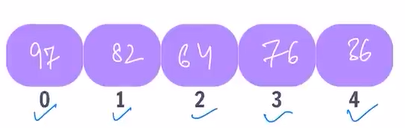
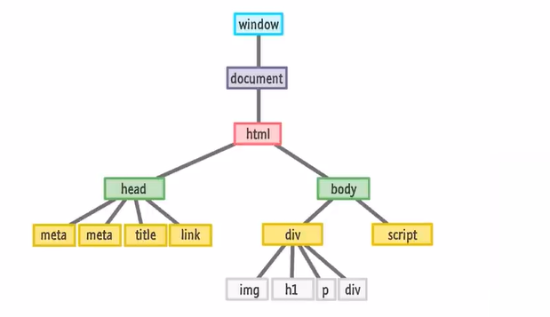
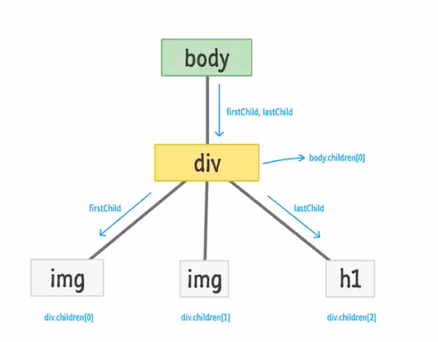
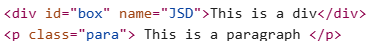
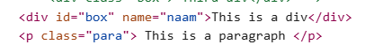

# JavaScript Tutorial

## Variable:
1. `var`: variable can be re-declared & updated. A global scope variable(It is a global variable can be accessed outside the block)

2. `let`: variable cannot be re-declared but can be updated. A block scope variable

3. `const`: Variable cannot be re-declared or updated. A block scope variable


| Keyword | Re-declare | Update | Scope      | Example Usage      |
|---------|:----------:|:------:|:----------:|-------------------|
| `var`   | ✅         | ✅     | Global     | `var age = 20;`   |
| `let`   | ❌         | ✅     | Block      | `let age = 20;`   |
| `const` | ❌         | ❌     | Block      | `const age = 20;` |

```js
// var keyword
var age = 20;
age = 22; 
console.log(age);

var age = 23//Can be modified and re declared
console.log(age);

//let keyword
let age1 = 20;
age1=21; //Only modification allowed
console.log(age1);

//const
const age2=24
console.log(age2);
```
---


## Data types in JS: (to check data type: typeof())

### 1. Primitive Data Types:
- **Number**
- **String**
- **Boolean**
- **Undefined**
- **Null**
- **BigInt**
- **Symbol**

```js
//Data Types
age=25;
name="Tony Stark"
price=99.99;
x=null;
y=undefined;
isFollow=false;
let m = BigInt("123");
let n = Symbol("hello");

//Printing values
console.log(name);
console.log(age);
console.log(x);
console.log(price);
console.log(y);
console.log("Priyanshu K Sharma")
console.log(m);
console.log(n);

//Checking data type of variables
typeof(price);
```

### 2. Non-Primitive Data Types:

#### Objects-> collection of values
The key values in declared objects can be changed even though it is declared with the keyword **const**, but cannot create a dupilcate object with the same name.

```js
const Object_name = {
    key : value
    key1 : value
    key2 : value
    key3 : value
    key4 : value
};
```

to access any key:
1. Object_name.key
2. Object_name["key"]

---

## Operators: used to perform some operation on data


### 1. Arithmetic Operators
1. Modulus(%)-> Gives remainder
2. Exponentiation-> power
3. Increment(++)
4. Decrement(--)

```bash
+, -, *, / 

++a, --a -> pre(pehle change karrta hai value phir print karrta hai)
a++, a-- -> post(pehle print karrega phir value change karega)
```
----

### 2. Assignment Operators
Used to assign values to variables

```js
=, +=, -=, *=, %=, **=
```
----

### 3. Comparison Operators
Used to compare two values

```js
>, >=, <, <=


== -> Euqal to
!= -> Not equal to
=== -> Equal to & type(checks if the data types are same or not)
!== -> Not equal & type(checks if the data types differ or not)
```
----

### 4. Logical Operators
Used to check the logic of the expression: true or false

```js
&& -> Logical AND
|| -> Logical OR
! -> NOT
```
----

### 5. Ternary Operator
```js
condition ? true output : false output;

age > 18 ? "adult" : "not adult";
```
| Type         | Operators                                      |
|--------------|------------------------------------------------|
| Arithmetic   | `+`, `-`, `*`, `/`, `%`, `**`, `++`, `--`      |
| Assignment   | `=`, `+=`, `-=`, `*=`, `/=`, `%=`, `**=`       |
| Comparison   | `>`, `<`, `>=`, `<=`, `==`, `!=`, `===`, `!==` |
| Logical      | ||, !, &&                                       |
| Ternary      | `condition ? expr1 : expr2`                    |

---

## Conditional Statements: To implement some conditions in code


### 1. if Statement

```js
let color;
if(mode === "dark-mode") {
  color = "black";
}
```
----

### 2. if-else Statement
```js
let num = 20;

if (num%2===0) {
    console.log(num,"is Even");
}   else {
    console.log(num, "is Odd");
}
```
----

### 3. else-if Statement
```js
let age = 18

if(age < 18) {
    console.log("Junior");
}   else if(age>60)  {
    console.log("Senior citizen");
}   else {
    console.log("middle");
}
```
---

## Input and Display
```js
alert("Hello!"); //displays one time pop up msg

let num = prompt("Enter a number"); //displays msg as well as takes the input
```
---

## Loops in JS: Loops are used to execute a piece of code again and again


### 1. for loop

```js
for(let i=1; i<=5; i++) {
  console.log("priyanshu");
}
```
----

### 2. Infinite Loop-> A loop that never ends
```js
for(let count=1; count>0; count++) {
    console.log("Priyanshu K Sharma");
}

console.log("Loop has ended");
```
----

### 3. while loop
```js
while(condition) {
  // do some work
}
```
----

### 4. do while loop
```js
do{
  // do some work
}while(condition);
```

### 5. for-of loop-> used for strings and arrays
```js
for(let val of strVar) {
    //do some work
}
```
----

### 6. for-in loop-> used for objects
```js
for(let key in objVar) {
    // do some work
}
```

| Loop Type   | Syntax Example |
|-------------|---------------|
| `for`       | `for(let i=0; i<5; i++) { ... }` |
| `while`     | `while(condition) { ... }`       |
| `do-while`  | `do { ... } while(condition);`   |
| `for-of`    | `for(let val of arr) { ... }`    |
| `for-in`    | `for(let key in obj) { ... }`    |

---
## Strings in JS -> String is a sequence of characters used to represent text(It is immutable in java)

### 1. Create String
```js
let str="Priyanshu";
```
----

### 2. String Length
```js
str.length
```
----

### 3. String Indices
```js
str[0], str[1], str[2]
```
----

### 4. Template Literals->A way to have embedded expressions in strings

```js
`The cost of ${obj.item} is ${obj.price}`
```
----

#### String Interpolation-> To create strings by doing substitution of placeholders

```js
`String text ${expresiion} string text`
\n: Next line
\t: Tab
```
----

#### Use case of Template literals
```js
let obj = {
    item: "pen",
    price: 10,
};

let output = `The cost of ${obj.item} is ${obj.price}`;
console.log(output);
```
----
### String Methods-> These are built-in functions to manipulate a string
- **Create:** `let str = "Priyanshu";`
- **Length:** `str.length`
- **Indices:** `str[0]`, `str[1]`
- **Template Literals:** `` `Hello, ${name}!` ``
- **Methods:** `.toUpperCase()`, `.toLowerCase()`, `.trim()`, `.slice()`, `.concat()`, `.replace()`, `.replaceAll()`, `.charAt()`


```js
str.toUpperCase()
str.toLowerCase()
str.trim() //removes whitespaces
str.slice(start, end) //returns part of string
str1.concat(str2)
str.replace(searchVal, newVal)
str.replaceAll(searchVal, newVal) //replaces all the recurring valuess
str.charAt(idx)
```
---
## Array in JS-> Collections of items, it is mutable
```js
let heroes = ["ironman", "hulk", "thor", "batman"];

let marks = [96, 75, 48, 83, 66];

let info = ["Rahul", 86, "Delhi"];
```
----
### Arrray indices-> stores data in linear and cotinuous form
```js
arr[0], arrr[1], arr[2], ....
```

<p align="center">
  
</p>

----
### Looping over an Array-> print all elements of array

#### for loop
```js
for(let idx=0; idx<arr.length; idx++) {
    console.log(arr[idx]);
}
```

-----

#### for of loop
```js
for(let a of arr) {
    console.log(a);
}
```
----

### Array Methods
```js
push(): add to end

pop(): delete from end & return

toString(): converts array to string

concat(): joins multiple arrays & returns result

unshift(): add to start

shift(): delete from start & return

slice(): returns a piece of the array-> used when we do not wwant to make changes in the entire array, just a slice of that -- slice(startIdx, endIdx)

splice(): change original array(add, remove, replace) -- splice(startIdx, delCount, newEl1....)
```
---

## Functions in JS
- Block of code that performs a specific task, can be invoked whenever needed
```js
function funcName() {
    //do some works
}

function funcName(param1, param2, ...) {
    //do some works
}

//function call
funcName();
```
----

### Arrow Functions
- Compact way of writing function
- Preferred for smaller block of code

```js
const funcName = (param1, param2, ...) => {
    //do some work
}
```

---
## Array Higher-Order Methods

| Method   | Description |
|----------|-------------|
| `forEach`| Executes a function for each array element |
| `map`    | Creates a new array with results of a function |
| `filter` | Creates a new array with elements that pass a test |
| `reduce` | Reduces array to a single value |

----
### forEach Loop in Arrays
```js
arr.forEach(callBackFunction)
```

- `callBackFunction`: Here, it is a function to execute for each element in the array
- A callback is a function passed as an argument to another function.
- Higher order function-> takes other functions as a parameter or return other function
- Method = function associated with object(func+obj)
- Used when user need to perform operations
- Example:

```js
arr.forEach((val)=>{
    console.log(val);
})
```

----
### Map

- Creates a new array with the results of an operation.
- The values returned by its callback function are used to form the new array.
- Used when the user need to create a new array based the operations performed on the previous array

```js
arr.map(callbackFnx(value, index, array))
```

```js
let newArr = arr.map((val)=>{
    return val*2;
})
```
----
### Filter

- Creates a new array of elements that give true for condotion/filter.
- Eg: all even elements
```js
let newArr = arr.filter((val)=>{
    return val%2===0;
})
```
----
### Reduce
- Performs some operations & reduce the array to a single value.
- It returns that single value.
```js
const sumWithInitial = array.reduce(
    (accumulator, currentValue)=> accumulator+currentValue, initialValue
);
```

---
## DOM: Document Object Module

### Window Object:
- The window object represents an open window in a browser.
- It is a browser's object(not JS's) & is automatically created by browser.
- It is a global object with lots of properties & methods.
- Try running `window` on browser console:
```js
window
window.console.log("hello");
```
----

### What is DOM?
- When a webpage is loaded, the browser creates a DOM of the page.
- The entire HTML code is accessible in JS in the form of document.
- `console.log()` -> print
```js
console.log(window);
```
- `console.dir()` -> document ->prints properties and methods:

```js
console.dir(window.document);
```

- Each box in the figure is `node`.

<p align="center">
  
</p>

- We use `DOM` to perform dynamic modifications which cannot be done in html and css:
```js
console.log(document.body.style.background="green");
```
- Output: 
<p align="center">
  
</p>

----

### DOM Manipulation
#### Accessing Elements:
1. Selecting with id:
```js
document.getElementById("myId")
```

2. Selecting with class:
```js
document.getElementsByClassName("myClass")
```

3. Selecting with tag:
```js
document.getElementsByTagName("p")
```

#### Query Selector:
1. Returning first element:
```js
document.querySelector("myId/myClass/tag");
```

2. Returning a NodeList:
```js
document.querySelectorAll("myId/myClass/tag");
```


#### Properties
1. `tagName`: returns tag for element nodes
2. `innerText`: returns the text content of the element and all its children
3. `innerHTML`: returns the plain text or HTML contents in the element
4. `textContent`: returns textual content even for hidden

<p align="center">
  
</p>

#### Attributes
- `getAttribute(attr)`: to get the attribute value
- `setAttribute(attr, value)`: to set the attribute value

<p align="center">
  
</p>

```js
let naam = div.setAttribute("name", "naam");
console.log(naam); //changes sttribute name
```

<p align="center">
  
</p>

----
#### Style
- `node.style`
```css
let div = document.querySelector("div");

div.style.backgroundColor="green";
```
----
#### Insert Elements
```js
let newBtn=document.createElement("button");
```

- `node.append(el)`: adds at the end of node(inside)
- `node.prepend(el)`: adds at the start of node(inside)
- `node.before(el)`: adds before the node(outside)
- `node.after(el)`: adds after the node(outside)

```js
div.prepend(newBtn)
div.append(newBtn)
div.before(newBtn)
div.after(newBtn)
```

----
#### Delete Element
- `node.remove()`: removes the node
---
```js
let para = document.querySelector("p");
para.remove()
```

----

#### `appendChild()`

1. **Purpose:**
- Adds a **new child node** to a parent node **at the end**.

2. **Syntax:**

```js
parentNode.appendChild(childNode);
```

3. **Example:**

```html
<div id="container"></div>
```

```js
let container = document.getElementById("container");
let newPara = document.createElement("p");
newPara.textContent = "This is a new paragraph.";

container.appendChild(newPara); // Adds <p> to the <div>
```
4. **Notes:**

* Moves the node if it already exists elsewhere in the DOM.
* Only one node can be appended at a time.

----

#### `removeChild()`

1. **Purpose:**

* Removes a **child node** from its parent.

2. **Syntax:**

```js
parentNode.removeChild(childNode);
```

3. **Example:**

```html
<ul id="list">
  <li>Item 1</li>
  <li id="remove-me">Item 2</li>
</ul>
```

```js
let list = document.getElementById("list");
let item = document.getElementById("remove-me");

list.removeChild(item); // Removes the <li> with id="remove-me"
```

4. **Notes:**

* You must call `removeChild()` on the **parent node**.
* It returns the removed node (you can re-append it later if needed).

---

- Combined Use

You can dynamically **move** an element:

```js
document.body.appendChild(document.getElementById("header")); // Moves #header to <body>
```
---
### classList
The `classList` property in JavaScript provides a convenient way to **add, remove, toggle, or check CSS classes** on an HTML element.

---

#### What is `classList`?

It's a **DOMTokenList** object that represents the list of classes assigned to an element. You can use it to manipulate class names **without dealing with string manipulation**.

---

### Syntax:

```js
element.classList
```

---

#### Common Methods:

| Method                   | Description                                   | Example                                               |
| ------------------------ | --------------------------------------------- | ----------------------------------------------------- |
| `.add("className")`      | Adds one or more class names                  | `element.classList.add("active")`                     |
| `.remove("className")`   | Removes one or more class names               | `element.classList.remove("active")`                  |
| `.toggle("className")`   | Adds class if not present, removes if present | `element.classList.toggle("dark-mode")`               |
| `.contains("className")` | Checks if class exists                        | `element.classList.contains("active")` → `true/false` |
| `.replace("old", "new")` | Replaces one class with another               | `element.classList.replace("old-class", "new-class")` |
| `.length`                | Returns number of classes                     | `element.classList.length`                            |

---

#### Example:

```html
<button id="myBtn" class="btn">Click me</button>
```

```js
let btn = document.getElementById("myBtn");

// Add class
btn.classList.add("active");

// Remove class
btn.classList.remove("btn");

// Toggle class
btn.classList.toggle("highlight");

// Check class
if (btn.classList.contains("active")) {
  console.log("Button is active");
}
```

---

#### Why use `classList`?

* **Cleaner and safer** than manipulating `element.className` as a string.
* Prevents duplicate classes.
* Easy to handle multiple classes at once.

----


### `DOM Tree` Overview:

The DOM represents an **HTML document as a tree of nodes**. Each part of the document—tags, text, comments—is a node. There are multiple node types, but the three most commonly used are:

---

#### 1. **Element Nodes (`Node.ELEMENT_NODE`)**

* Represent **HTML tags** (elements) like `<div>`, `<p>`, ``, etc.
* These nodes can **have attributes** and **child nodes** (including text or other elements).

**Example:**

```html
<p class="note">Hello World</p>
```

* The `<p>` tag is an **Element Node**.
* Its attributes (`class="note"`) belong to the element node.
* It may contain a **Text Node** as its child.

---

#### 2. **Text Nodes (`Node.TEXT_NODE`)**

* Contain the **text content** inside elements.
* They are **children of Element Nodes**.
* Every piece of text in the DOM is wrapped in a text node—even spaces and line breaks.

**Example:**

```html
<p>Hello World</p>
```

* `"Hello World"` is a **Text Node**, child of the `<p>` element.

---

#### 3. **Comment Nodes (`Node.COMMENT_NODE`)**

* Represent **HTML comments**: `<!-- This is a comment -->`
* They do not affect rendering but are part of the DOM and can be accessed/modified via JavaScript.

**Example:**

```html
<!-- This is a comment -->
```

* This is stored as a **Comment Node** in the DOM.

---

###  Visual DOM Tree Structure:

For this HTML:

```html
<p class="info">Hello <!--greeting--> World</p>
```

The DOM structure:

```js
Element Node: <p>
├── Attribute: class="info"
├── Text Node: "Hello "
├── Comment Node: "greeting"
└── Text Node: " World"
```

---

####  Accessing in JavaScript:

```js
const p = document.querySelector("p");

console.log(p.nodeType);             // 1 => ELEMENT_NODE
console.log(p.firstChild.nodeType);  // 3 => TEXT_NODE
console.log(p.childNodes[1].nodeType); // 8 => COMMENT_NODE
```

---

